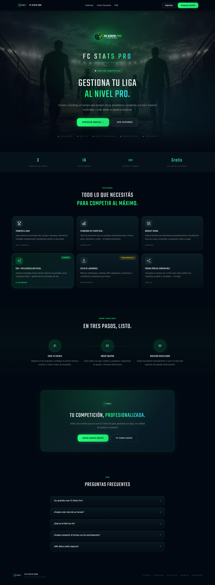
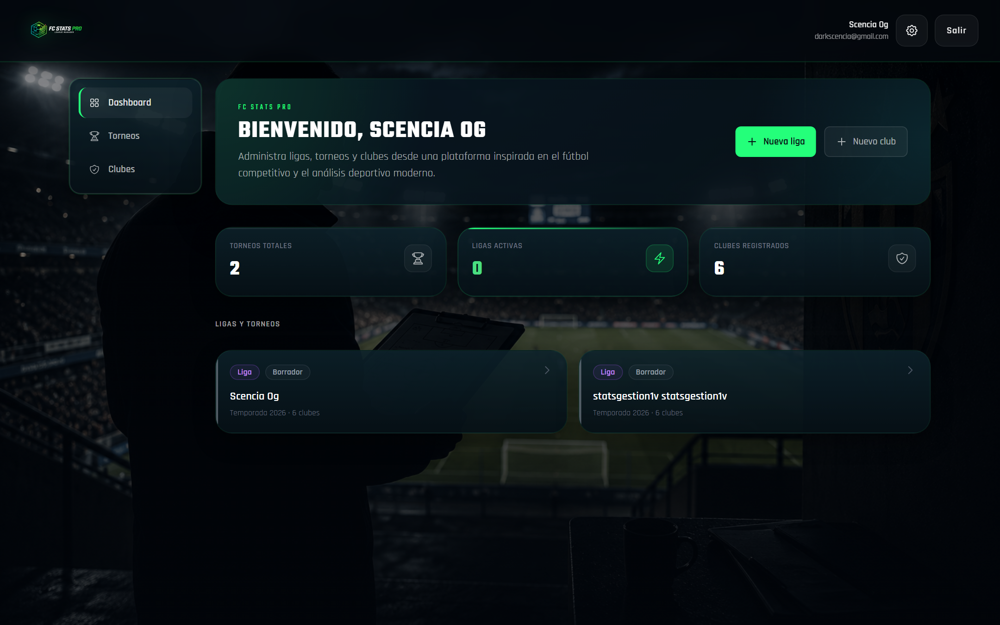
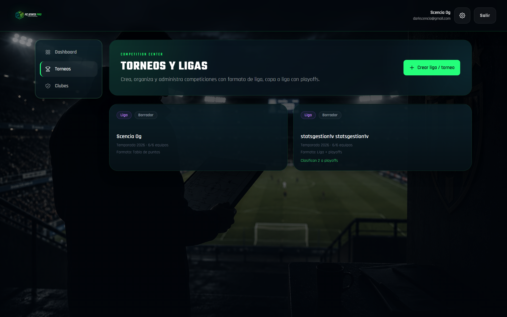
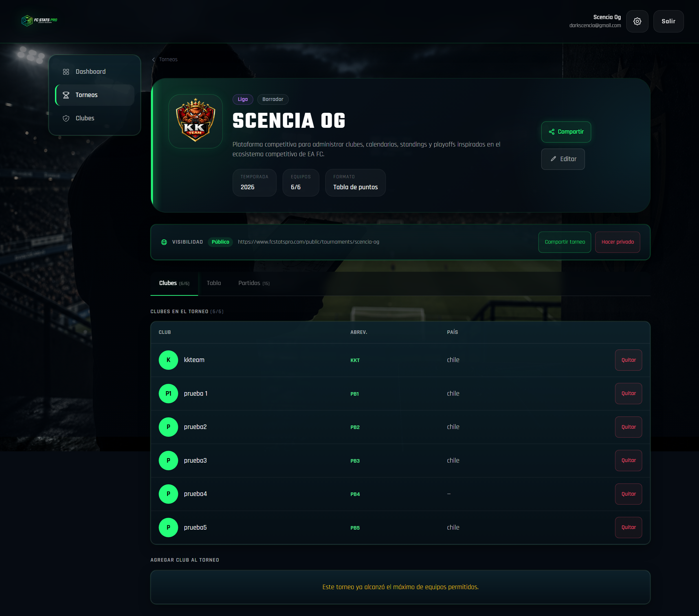
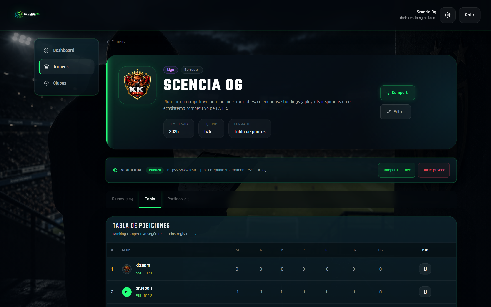
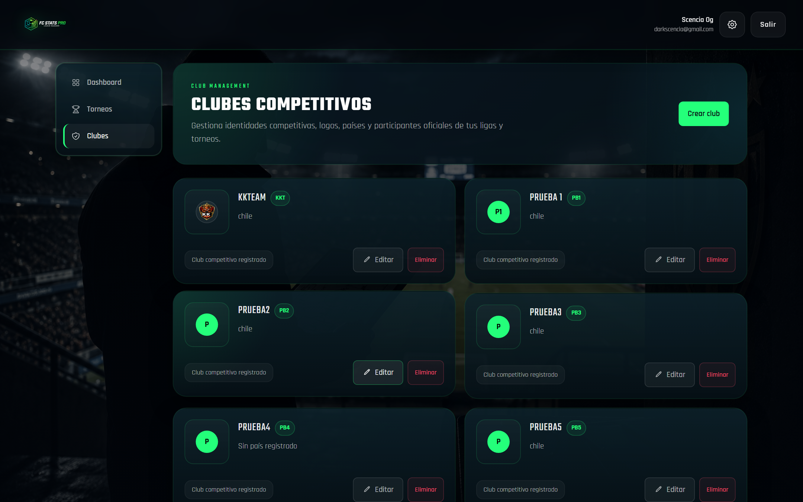
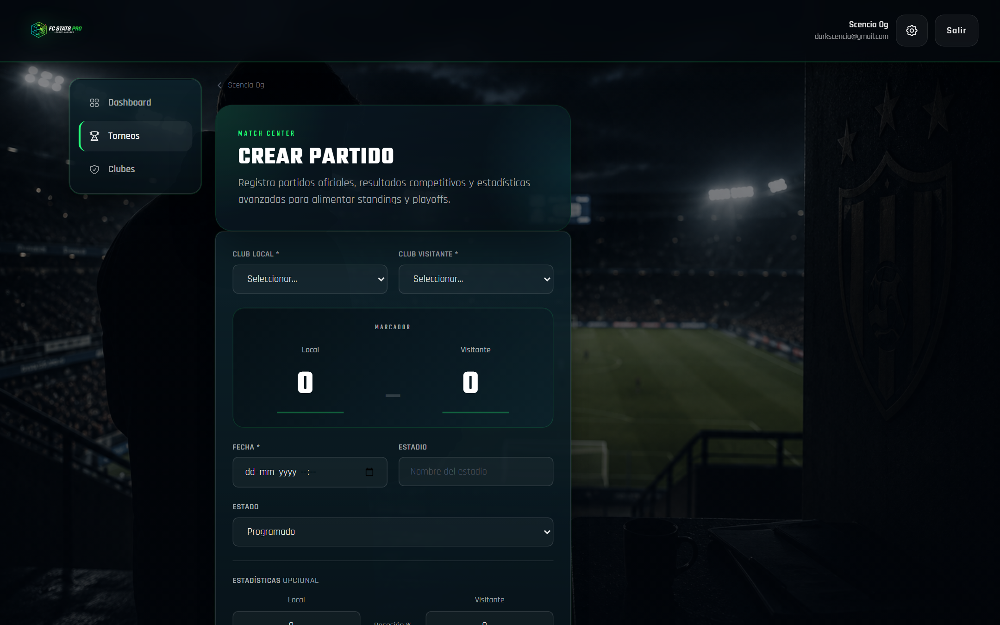
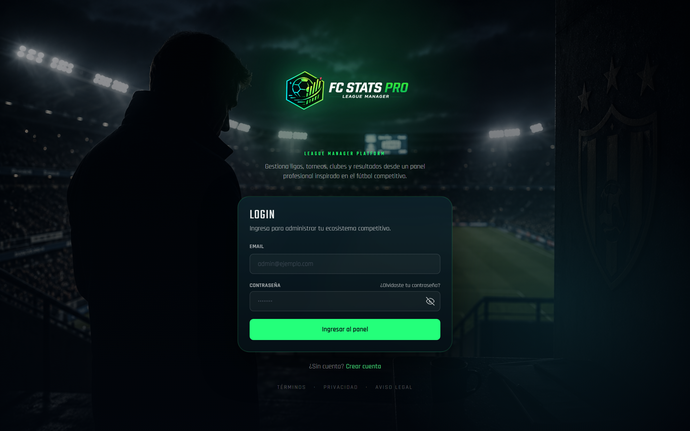
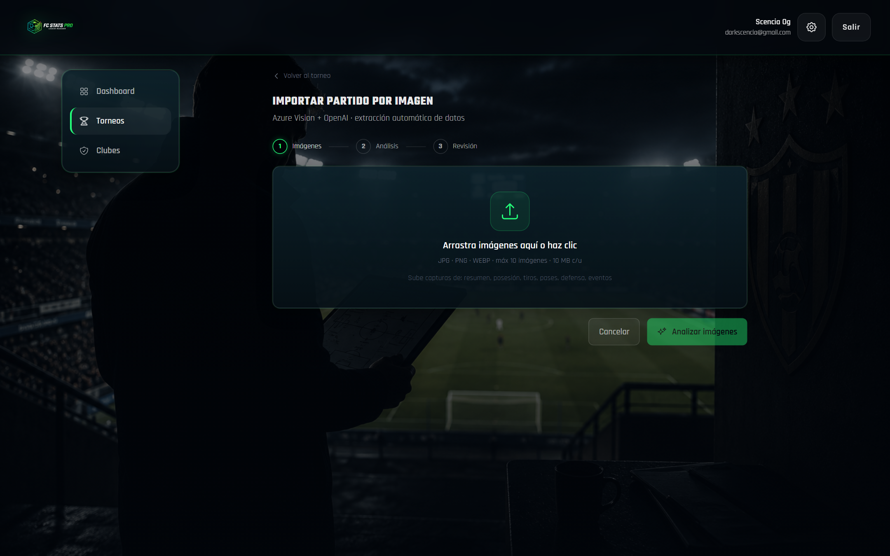

<div align="center">

# FC Stats Pro — League Manager

**Full-stack platform for managing football leagues, tournaments, and real-time standings**


<br/>



</div>

---

## Screenshots

<table>
  <tr>
    <td align="center"><b>Dashboard</b></td>
    <td align="center"><b>Tournaments</b></td>
  </tr>
  <tr>
    <td></td>
    <td></td>
  </tr>
  <tr>
    <td align="center"><b>Tournament Detail</b></td>
    <td align="center"><b>Standings Table</b></td>
  </tr>
  <tr>
    <td></td>
    <td></td>
  </tr>
  <tr>
    <td align="center"><b>Club Management</b></td>
    <td align="center"><b>Create Match</b></td>
  </tr>
  <tr>
    <td></td>
    <td></td>
  </tr>
  <tr>
    <td align="center"><b>Login</b></td>
    <td align="center"><b>AI / OCR Import</b></td>
  </tr>
  <tr>
    <td></td>
    <td></td>
  </tr>
</table>

---

## Overview

FC Stats Pro is a complete league management system for amateur and semi-professional football competitions. Administrators can create tournaments, manage clubs, register match results, and share live standings with players and fans — all through a clean, responsive web interface.

The platform integrates **AI-powered image recognition** to extract match scores directly from scoreboard photos, eliminating manual data entry after each game.

---

## Features

### League Management
- Create and manage multiple tournaments simultaneously (leagues, cups, mixed formats)
- Automatic standings table with real-time recalculation of points, goal difference, and head-to-head rules
- Automatic bracket generation for knockout stages and playoffs
- Configurable tournament visibility — private or publicly shareable via URL

### Club Administration
- Full CRUD for clubs with custom logo upload
- Club assignment to tournaments with squad management
- Visual team cards with branding

### Match Registration
- Manual score entry with validation
- **AI/OCR import** — photograph a scoreboard, the system extracts teams and scores automatically
- Confidence scoring on extracted data with manual review step
- Match history and edit/delete capabilities

### Public Pages
- Each tournament has a public URL (`/public/tournaments/:slug`) shareable with fans
- Open Graph meta tags for rich previews on WhatsApp, Twitter, and Facebook
- QR code generation for easy mobile access
- Tournament bracket viewer for playoff rounds

### Progressive Web App
- Installable on mobile devices (Android/iOS)
- Optimized icons and splash screens
- Service worker caching for offline viewing of standings

### Security
- JWT authentication with configurable expiration
- Helmet.js for secure HTTP headers
- Rate limiting on all critical endpoints
- CORS domain whitelist
- bcrypt password hashing
- Input validation on every route

---

## Tech Stack

| Layer | Technology |
|---|---|
| **Backend** | Node.js 20, Express 5 |
| **Database** | MongoDB 8 + Mongoose 8 |
| **Frontend** | React 18, Vite 5 |
| **Styling** | Tailwind CSS 3, Framer Motion |
| **Auth** | JSON Web Tokens (JWT) |
| **AI / OCR** | Azure Computer Vision, OpenAI GPT-4o-mini |
| **Email** | Nodemailer (SMTP) |
| **File Upload** | Multer |
| **Security** | Helmet.js, express-rate-limit |
| **PWA** | vite-plugin-pwa, Workbox |
| **Deployment** | Render (backend), static hosting (frontend) |

---

## Project Structure

```
fc-stats-pro-league-manager/
├── src/                        # Backend (Express API)
│   ├── config/                 # Database connection and env config
│   ├── controllers/            # Request handlers (auth, clubs, matches, AI)
│   ├── middlewares/            # JWT auth, rate limiter, file upload
│   ├── models/                 # Mongoose schemas (Tournament, Club, Match, Admin)
│   ├── routes/                 # Route definitions
│   │   ├── auth.routes.js
│   │   ├── tournament.routes.js
│   │   ├── club.routes.js
│   │   ├── match.routes.js
│   │   ├── table.routes.js
│   │   ├── public.routes.js
│   │   └── ai.routes.js
│   ├── services/               # AI/OCR pipeline services
│   └── utils/                  # Helpers and shared utilities
├── frontend/                   # React + Vite SPA
│   └── src/
│       ├── pages/              # Route-level page components
│       ├── components/         # Reusable UI components
│       ├── auth/               # Auth context and protected routes
│       ├── api/                # Axios client and API calls
│       └── assets/             # Static assets
├── docs/                       # Extended documentation
├── render.yaml                 # Render deployment config
└── package.json
```

---

## Quick Start

### Prerequisites

- Node.js 20+
- MongoDB (Atlas or local)
- npm or yarn

### Installation

```bash
# Clone the repository
git clone https://github.com/your-username/fc-stats-pro-league-manager.git
cd fc-stats-pro-league-manager

# Install backend dependencies
npm install

# Install frontend dependencies
cd frontend && npm install && cd ..

# Configure environment variables
cp .env.example .env
# Fill in your values (see Environment Variables section below)
```

### Development

```bash
# Terminal 1 — Backend (http://localhost:3000)
npm run dev

# Terminal 2 — Frontend (http://localhost:5173)
cd frontend
npm run dev
```

### Production Build

```bash
# Backend
npm start

# Frontend
cd frontend && npm run build
```

---

## Environment Variables

```env
# Database
MONGO_URI=mongodb+srv://<user>:<password>@cluster.mongodb.net/fcstats

# Auth
JWT_SECRET=<minimum 32 characters>
JWT_EXPIRES_IN=7d

# CORS (comma-separated)
CLIENT_URL=http://localhost:5173,https://app.yourdomain.com
FRONTEND_URL=https://app.yourdomain.com

# AI / OCR
AZURE_VISION_ENDPOINT=https://<resource>.cognitiveservices.azure.com/
AZURE_VISION_KEY=<key>
AZURE_VISION_API_VERSION=2023-10-01
OPENAI_API_KEY=sk-...

# AI confidence thresholds
AI_SCORE_CONFIDENCE_MIN=0.85
AI_STATS_CONFIDENCE_MIN=0.70
AI_IMPORT_MAX_IMAGES=10

# Email (SMTP)
SMTP_HOST=smtp.gmail.com
SMTP_PORT=465
SMTP_SECURE=true
SMTP_USER=your@email.com
SMTP_PASS=<app password>
SMTP_FROM=FC Stats Pro <your@email.com>

# Server
PORT=3000
NODE_ENV=production
```

---

## API Reference

All protected endpoints require `Authorization: Bearer <token>`.

### Authentication

| Method | Endpoint | Description |
|--------|----------|-------------|
| `POST` | `/auth/register` | Create account |
| `POST` | `/auth/login` | Login and receive JWT |
| `POST` | `/auth/forgot-password` | Send password reset email |
| `POST` | `/auth/reset-password` | Reset password with token |

### Tournaments

| Method | Endpoint | Description |
|--------|----------|-------------|
| `GET` | `/tournaments` | List my tournaments |
| `POST` | `/tournaments` | Create tournament |
| `GET` | `/tournaments/:id` | Get tournament detail |
| `PUT` | `/tournaments/:id` | Update tournament |
| `DELETE` | `/tournaments/:id` | Delete tournament |

### Clubs

| Method | Endpoint | Description |
|--------|----------|-------------|
| `GET` | `/clubs` | List clubs |
| `POST` | `/clubs` | Create club (with logo upload) |
| `PUT` | `/clubs/:id` | Update club |
| `DELETE` | `/clubs/:id` | Delete club |

### Matches

| Method | Endpoint | Description |
|--------|----------|-------------|
| `GET` | `/matches` | List matches |
| `POST` | `/matches` | Create match |
| `PUT` | `/matches/:id` | Update result |
| `DELETE` | `/matches/:id` | Delete match |

### Standings & Brackets

| Method | Endpoint | Description |
|--------|----------|-------------|
| `GET` | `/table/:tournamentId` | Get live standings |
| `GET` | `/tournaments/:id/bracket` | Get bracket data |

### AI / OCR

| Method | Endpoint | Description |
|--------|----------|-------------|
| `POST` | `/ai/import-image` | Extract match data from image |
| `POST` | `/ai/validate` | Validate AI-extracted data |

### Public (no auth required)

| Method | Endpoint | Description |
|--------|----------|-------------|
| `GET` | `/public/tournaments/:slug` | Public tournament view |
| `GET` | `/public/tournaments/:slug/standings` | Public standings |
| `GET` | `/public/tournaments/:slug/bracket` | Public bracket |

---

## AI / OCR Pipeline

1. User uploads a photo of a scoreboard via the "Import Match" screen
2. Image is sent to **Azure Computer Vision** for text extraction
3. Extracted text is parsed and structured by a custom normalization layer
4. **OpenAI GPT-4o-mini** validates the team names against the tournament's registered clubs
5. A confidence score is calculated — results above the threshold are pre-filled in the form
6. The user reviews and confirms before saving

This flow eliminates typos and speeds up match registration for league administrators managing high match volumes.

---

## Deployment

The backend is configured for **Render** via `render.yaml`. Set the required environment variables in the Render dashboard (they are not synced automatically — marked `sync: false` in the config).

For the frontend, run `npm run build` inside `/frontend` and deploy the generated `/dist` folder to any static hosting provider (Vercel, Netlify, Cloudflare Pages, etc.).

Full deployment guide: [`docs/DEPLOYMENT.md`](./docs/DEPLOYMENT.md)

---

## Documentation

| Document | Description |
|---|---|
| [`docs/INSTALLATION.md`](./docs/INSTALLATION.md) | Step-by-step local setup guide |
| [`docs/ARCHITECTURE.md`](./docs/ARCHITECTURE.md) | System design and technical decisions |
| [`docs/API.md`](./docs/API.md) | Full API reference |
| [`docs/AI_PIPELINE.md`](./docs/AI_PIPELINE.md) | OCR pipeline internals |
| [`docs/DEPLOYMENT.md`](./docs/DEPLOYMENT.md) | Production deployment guide |
| [`CHANGELOG.md`](./CHANGELOG.md) | Version history |
| [`ROADMAP.md`](./ROADMAP.md) | Planned features and milestones |

---

## Roadmap Highlights

- [ ] Real-time notifications via WebSockets
- [ ] Per-player statistics and performance tracking
- [ ] Advanced analytics with charts and trends
- [ ] Mobile app (React Native) with built-in OCR camera
- [ ] PDF/Excel export of final standings
- [ ] Social sharing with auto-generated match images

---

## License

ISC © 2025 Rodrigo

---

<div align="center">
  Built with Node.js, React, and MongoDB
</div>
